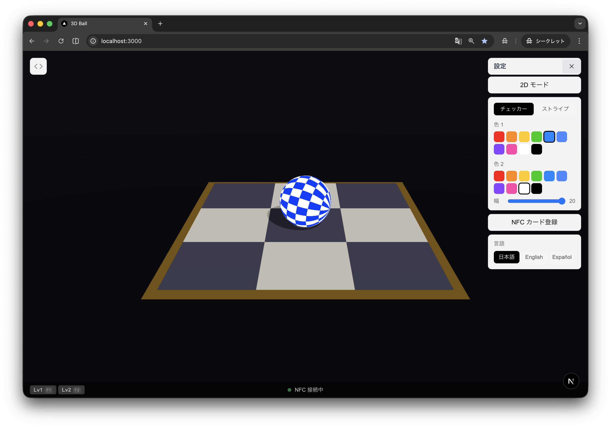

# 3D Ball

Three.js (React Three Fiber) を使った 3D ボール操作アプリ。NFC カードによるプログラミング体験を通じて、低年齢向け STEM 教育をサポートします。



## 機能

- **3D / 2D 表示切替** — 斜め視点の 3D モードと、真上から見下ろす 2D モードをスムーズなカメラアニメーションで切り替え
- **ボールの転がりアニメーション** — 移動方向に応じた物理的な回転アニメーション付き
- **模様カスタマイズ** — チェッカー / ストライプの 2 種類。色とパターンの幅をリアルタイムで変更可能
- **NFC カード操作** — USB NFC リーダー (Sony RC-S300 等) を接続し、方向・ジャンプ・ループ・分岐カードを割り当てて操作
- **プログラミングモード** — NFC カードで命令列を作成し、Run で順次実行。x2/x3 ループカードで繰り返し、？カードで条件分岐 (if-else)
- **NTAG 書き込み** — 作成したプログラムを NTAG カードに NDEF URL として書き込み、スマホで読み取ってリプレイ
- **リプレイページ** — URL パラメータからプログラムを再生。Vercel で公開中
- **レベルシステム** — Lv1/Lv2/Lv3 のステージ制。レベルごとに異なるグリッドサイズ・ルール
- **効果音** — Web Audio API で合成。移動・ジャンプ・壁バンプ・成功・バースト・分岐など (外部ファイル不要)

## レベルシステム

### Lv1 — ゴールをめざそう！ (F1)

- **グリッド**: 3x3
- ランダムなスタート (緑) とゴール (オレンジ) が配置される
- ゴールに到達するとファンファーレ + ジャンプアニメーションでクリア
- 「お題」モード (Tab): 指定された移動数ぴったりでゴールを目指す
  - 超過・不一致でバーストアニメーション + スタートリセット

### Lv2 — 障害物をさけてゴール！ (F2)

- **グリッド**: 5x5
- 2〜4 個の障害物 (赤いブロック) がランダム配置 (BFS で経路存在を保証)
- 障害物を避けてゴールを目指す
- **x2/x3 ループカード** (プログラミングモード専用):
  - 直前の命令を繰り返す (`→ ×2` = 右に 2 回)
  - 連続使用は加算 (`→ ×2 ×3` = 右に 5 回)
  - プログラミングパネルではグループ表示 (例: `RIGHT ×3`)

### Lv3 — ？で分岐してゴール！ (F3)

- **グリッド**: 5x5
- 1〜2 個の「？」セル (条件分岐ポイント、紫ダイヤモンドマーカー) がランダム配置
  - 四隅には配置されない (デッドロック防止)
- **ゴール到達には「？」セルを一度は経由する必要がある**
- 「？」セルでの分岐ルール:
  - 水平方向 (LEFT/RIGHT) から到着 → 垂直方向 (UP or DOWN) へ自動移動
  - 垂直方向 (UP/DOWN) から到着 → 水平方向 (LEFT or RIGHT) へ自動移動
- **「？」カード** (プログラミングモード、Lv3 専用):
  - 方向カードに付けると if-else 分岐ブロックを作成
  - 例: `→ ×4 ❓` → `もし (⬆ UP) { ... } それ以外 (⬇ DOWN) { ... }`
  - 「？」セルに到着した場合 → 分岐方向に応じて if/else ブロックを実行
  - 「？」セルにいない場合 → 両方スキップ
  - ネスト (入れ子) は不可
- お題なし。「マップ変更」ボタン (Tab) でマップを再生成

## 技術スタック

- [Next.js](https://nextjs.org/) 16 (App Router)
- [React Three Fiber](https://docs.pmnd.rs/react-three-fiber) + [drei](https://github.com/pmndrs/drei)
- [Three.js](https://threejs.org/) (カスタムシェーダーマテリアル)
- [nfc-pcsc](https://github.com/nicedoc/nfc-pcsc) (NFC リーダー連携)
- [better-sqlite3](https://github.com/WiseLibs/better-sqlite3) (NFC カード登録の永続化)
- [Tailwind CSS](https://tailwindcss.com/) 4

## セットアップ (開発)

```bash
npm install
npm run dev
```

http://localhost:3000 を開いてください。

## NFC カードの使い方

1. USB NFC リーダーを接続する
2. http://localhost:3000/nfc にアクセス
3. 方向 (上 / 下 / 左 / 右)・ジャンプ・ループ (x2 / x3)・分岐 (？) を選択
4. NFC カードをリーダーにかざして登録
5. 8 枚のカードにそれぞれアクションを割り当てる
6. メインページでカードをかざすとボールが移動 (ループ・分岐カードはプログラミングモード専用)

> NFC 機能は UID ベースのマッピング方式です。FeliCa カード (Suica 等) にも対応しています。カードへの書き込みは行わず、カードの固有 ID とアクションの対応をサーバーメモリ + SQLite に保持します。

## Windows ポータブル配布

イベント会場で複数の Windows PC にデプロイするためのポータブル配布機能です。

### 背景

STEM ブースとして出展する際、NFC カードリーダー付きの PC を複数台用意する必要があります。Docker は NFC リーダー (PC/SC デバイス) をコンテナにパススルーできないため、Node.js ポータブル版を同梱する方式を採用しました。

### 課題: ネイティブモジュールのクロスプラットフォームビルド

`nfc-pcsc` が依存する `@pokusew/pcsclite` はネイティブ C++ アドオン (`.node` ファイル) です。macOS でビルドした `.node` ファイルは Windows では動作しません (`not a valid Win32 application`)。

Windows 上でリビルド (`npm rebuild`) するには **Python** と **Visual Studio Build Tools** (C++ デスクトップ開発ワークロード) のインストールが必要ですが、これはポータブル配布の「何もインストールしない」という方針に反します。

### 解決策: GitHub Actions でビルド

**GitHub Actions の `windows-latest` ランナー**を使うことで、この問題を完全に解決しました。

- ランナーには Python、Visual Studio Build Tools が**プリインストール済み**
- ネイティブモジュールが Windows 用に正しくコンパイルされる
- ビルド済みの `.next` 出力も同梱されるため、配布先でのビルド不要
- macOS / Linux の開発環境から `gh workflow run` で実行可能

### ビルド手順

1. **ワークフローを実行** (GitHub Actions > "Build Windows Portable ZIP" > Run workflow)
   ```bash
   # CLI からも実行可能
   gh workflow run build-windows.yml
   ```

2. **アーティファクトをダウンロード**
   ```bash
   # 最新のランIDを確認
   gh run list --workflow=build-windows.yml --limit 1

   # ダウンロード
   gh run download <RUN_ID> --name 3dball-portable --dir 3dball-portable-win
   ```

3. **ZIP に圧縮して配布**
   ```bash
   zip -r 3dball-portable.zip 3dball-portable-win/
   ```

### 各 Windows PC での使い方

1. ZIP を展開
2. `start.bat` をダブルクリック
3. http://localhost:3000 にアクセス
4. NFC リーダーは Windows の PC/SC ドライバ (WinSCard) 経由で自動認識

> 配布先の PC には**何もインストールする必要がありません**。Node.js もアプリフォルダ内に自己完結しており、レジストリや PATH の変更は一切行いません。フォルダを削除すれば完全にクリーンアップされます。

### 含まれるファイル

| パス | 内容 |
|------|------|
| `node/` | Node.js v22 ポータブル (Windows x64) |
| `node_modules/` | 全依存パッケージ (Windows 用ネイティブバイナリ含む) |
| `.next/` | ビルド済みプロダクションアプリ |
| `start.bat` | 起動スクリプト (ダブルクリック) |
| `scripts/setup.ps1` | 初回セットアップスクリプト (手動ビルド時用) |
| `scripts/pack.ps1` | ZIP 作成スクリプト (手動ビルド時用) |
| `data/` | SQLite DB 用 (空) |

### ワークフロー設定

`.github/workflows/build-windows.yml` で以下を行っています:

- Node.js 22 + Windows ランナーで `npm install --include=optional`
- `NEXT_PUBLIC_BASE_URL` を設定してプロダクションビルド
- `node -e "require('nfc-pcsc')"` でネイティブモジュールの動作確認
- Node.js ポータブル版をダウンロードして同梱
- アーティファクトとしてアップロード (30日間保持)

## デプロイ

- **Vercel**: https://3dball-hazel.vercel.app — リプレイページ (`/replay`) のみ公開
- **ローカル (macOS)**: `npm run dev` でフル機能
- **Windows ポータブル**: 上記の「Windows ポータブル配布」セクション参照

## プロジェクト構成

```
app/
  page.tsx              # メインページ
  Ball.tsx              # 3D シーン (盤面、ボール、カメラ、操作)
  components/
    Scene.tsx           # 共有 3D コンポーネント
  nfc/
    page.tsx            # NFC カード登録ページ
    NfcWriter.tsx       # 登録 UI コンポーネント
  replay/
    page.tsx            # リプレイページ (サーバーコンポーネント)
    ReplayScene.tsx     # リプレイ UI (クライアントコンポーネント)
  api/nfc/
    route.ts            # NFC ステータス・登録 API
    read/route.ts       # NFC 読み取りイベント API
    write/route.ts      # NTAG 書き込み API
lib/
  ball-shared.ts        # 共有ロジック (定数、シェーダー、エンコード、ループ展開)
  levels.ts             # レベル定義 (LevelConfig、障害物生成、BFS)
  useLevel.ts           # レベル状態管理フック
  useProgramRunner.ts   # プログラム実行エンジン (共有フック)
  sounds.ts             # 効果音 (Web Audio API)
  nfc.ts                # NFC リーダー管理 (nfc-pcsc シングルトン)
  db.ts                 # SQLite による NFC カード登録永続化
  i18n.tsx              # i18n (日本語 / 英語 / スペイン語)
scripts/
  setup.ps1             # Windows 初回セットアップ
  pack.ps1              # Windows 配布用 ZIP 作成
.github/workflows/
  build-windows.yml     # GitHub Actions: Windows ポータブル ZIP ビルド
```

## 操作方法

### キーボードショートカット

| キー | 操作 |
|------|------|
| 矢印キー | ボール移動 |
| Space | ジャンプ |
| F1 | Lv1 ON/OFF |
| F2 | Lv2 ON/OFF |
| F3 | Lv3 ON/OFF |
| Escape | レベル解除 |
| Tab | お題を出す (Lv1/Lv2) / マップ変更 (Lv3) |
| Enter | つぎへ (クリア時) / Run (プログラミングモード) |
| Shift+Enter | プログラムあり: 「？」セルの分岐方向を逆転して実行 (隠しモード) / プログラム空: New |
| P | プログラミングモード ON/OFF |
| S | 設定パネル ON/OFF |
| D | 2D/3D 表示切替 |
| Backspace | プログラム末尾の命令を削除 (プログラミングモード) |

### テンキー (BUFFALO BSTKH100)

NumLock を OFF にして使用します。イベント会場等でテンキーだけでアプリをフルコントロールできます。

```
┌───────┬───────┬───────┬───────┐
│  Tab  │   /   │   *   │ Back  │
│ お題  │ Prog  │ 設定  │ 削除  │
├───────┼───────┼───────┼───────┤
│   7   │   8   │   9   │   -   │
│       │   ↑   │ 2D/3D │Lv解除 │
├───────┼───────┼───────┼───────┤
│   4   │   5   │   6   │   +   │
│   ←   │ Jump  │   →   │Lv切替 │
├───────┼───────┼───────┼───────┤
│   1   │   2   │   3   │ Enter │
│       │   ↓   │       │  Run  │
├───────┼───────┴───────┼───────┤
│   0   │      00       │   .   │
│  New  │     New       │ お題  │
└───────┴───────────────┴───────┘
```

| キー | 操作 |
|------|------|
| 4 / 8 / 6 / 2 | ボール移動 (←↑→↓) |
| 5 | ジャンプ |
| / | プログラミングモード ON/OFF |
| * | 設定パネル ON/OFF |
| 9 | 2D/3D 表示切替 |
| + | レベルサイクル切替 (OFF→Lv1→Lv2→Lv3→OFF) |
| - | レベル解除 |
| 0 / 00 | New (プログラムクリア + リセット) |
| BackSpace | プログラム末尾の命令を削除 |
| . (Del) | お題を出す / マップ変更 |
| Tab | お題を出す / マップ変更 |
| Enter | Run / つぎへ |

### NFC カード

| カード | 動作 |
|--------|------|
| 上 / 下 / 左 / 右 | ボールを移動 |
| ジャンプ | ボールをジャンプ |
| x2 / x3 | 直前の命令を繰り返し (プログラミングモード専用) |
| ？ | 方向カードに条件分岐を追加 (Lv3 プログラミングモード専用) |
